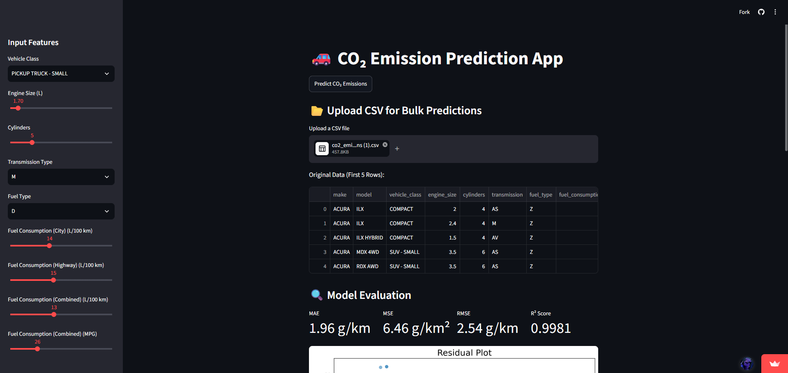

# 🚗 CO₂ Emission Prediction App

A Streamlit app that predicts vehicle CO₂ emissions (g/km) from vehicle specifications, powered by an XGBoost regression pipeline trained on Canadian vehicle emissions data.

## Use the Trained Model
**🔗 Live demo:** [co2emissions-zkwn3fweqlqmcuir8fnbj4.streamlit.app](https://co2emissions-zkwn3fweqlqmcuir8fnbj4.streamlit.app/)



### Features

- **Single prediction** — set vehicle class, engine size, cylinders, transmission, fuel type, and fuel consumption via the sidebar, and get an instant CO₂ estimate.
- **Bulk prediction** — Upload CSV file with vehicle specifications to use the batch predictions feature. When the uploaded CSV includes actual CO2 emissions, the app displays MAE, MSE, RMSE, and R² + a residual plot.

## Model Performance (on held-out test set)

| Metric | Value |
|---|---|
| MAE | 2.16 g/km |
| MSE | 8.88 g/km² |
| RMSE | 2.98 g/km |
| R² Score | 0.9976 |

## Training Process & How it works

The training pipeline takes the dataset, scales the numerical columns with StandardScaler and Encodes the categorical columns with OneHotEncoder. 

The preprocessed data is used to train the XGBoost Model. The same pipeline is used in the app to predict raw CO₂ emissions in g/km.


Bundling preprocessing and the model into one pipeline means the exact transformations used at training time are guaranteed to match what's applied to user input in the app.

## Dataset

[CO2 Emission by Vehicles](https://www.kaggle.com/datasets/debajyotipodder/co2-emission-by-vehicles) (Kaggle), originally sourced from [Canada's official open government data portal](https://open.canada.ca/data/en/dataset/98f1a129-f628-4ce4-b24d-6f16bf24dd64), released under the **Open Government Licence – Canada**. Contains 7,385 vehicles across 12 columns, covering 7 model years of fuel consumption and CO₂ emissions ratings.

## Project Structure

```
├── .devcontainer/
├── assets/
│   └── app_screenshot.png
├── data/
│   └── co2_emissions.csv        # training dataset
├── models/
│   └── co2_pipeline.pkl         # trained preprocessing + XGBoost pipeline
├── notebooks/
│   └── eda_and_training.ipynb   # EDA, preprocessing, training, evaluation
├── LICENSE
├── main.py                      # Streamlit app
├── requirements.txt
└── README.md
```

## Tech Stack

`Streamlit` · `scikit-learn` · `XGBoost` · `pandas` · `NumPy` · `Matplotlib` · `joblib`

## License

Code in this repository is available under the [MIT License](LICENSE). The dataset retains its original **Open Government Licence – Canada** — see the [source](https://open.canada.ca/data/en/dataset/98f1a129-f628-4ce4-b24d-6f16bf24dd64) for terms.

## Limitations & Future Work

- Trained on Canadian light-duty vehicles only — may not generalize well to other markets or vehicle types.
- No confidence intervals on predictions.
- Could add feature-importance / SHAP explainability to show why a prediction was made.
